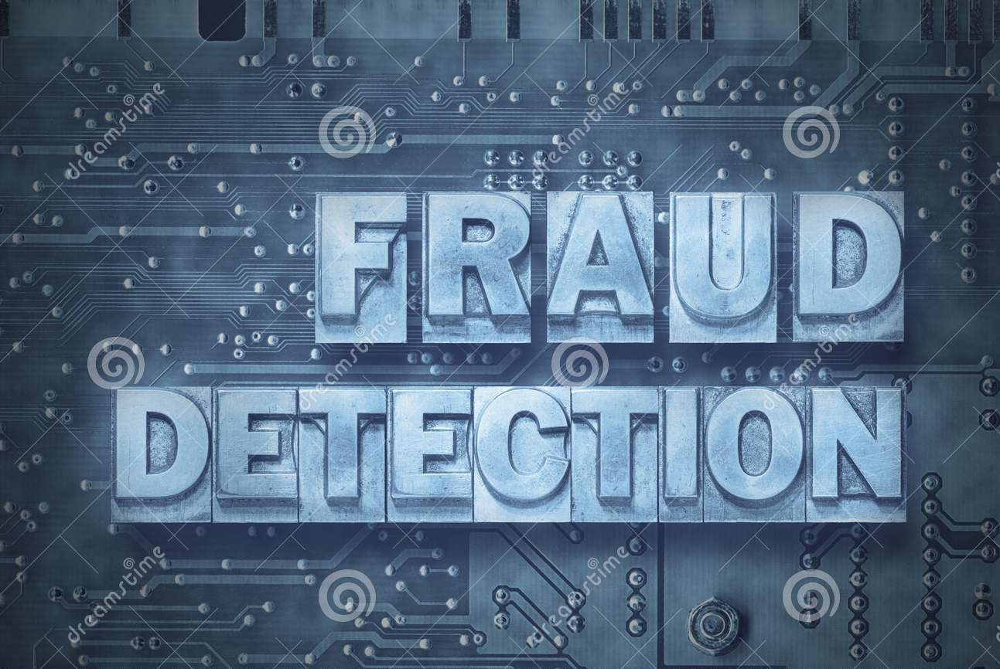

# Data Science Portfolio
---
## Machine learning

### Fraud Detection

Fraud detection is a set of processes and analyses that allow businesses to identify and prevent unauthorized financial activity. This can include fraudulent credit card transactions, identify theft, cyber hacking, insurance scams, and more.

---

# My Personal Notes
---
## Programming Notes
This are the set of notes for various languages which are prepared during the university visits (As a visiting professor).

---
